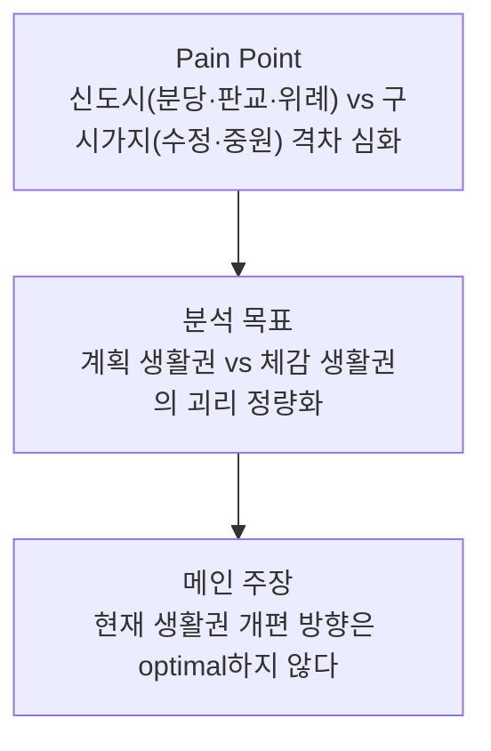
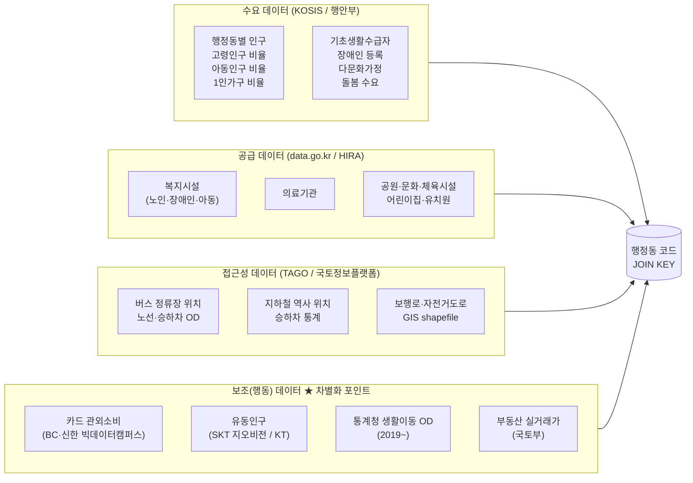
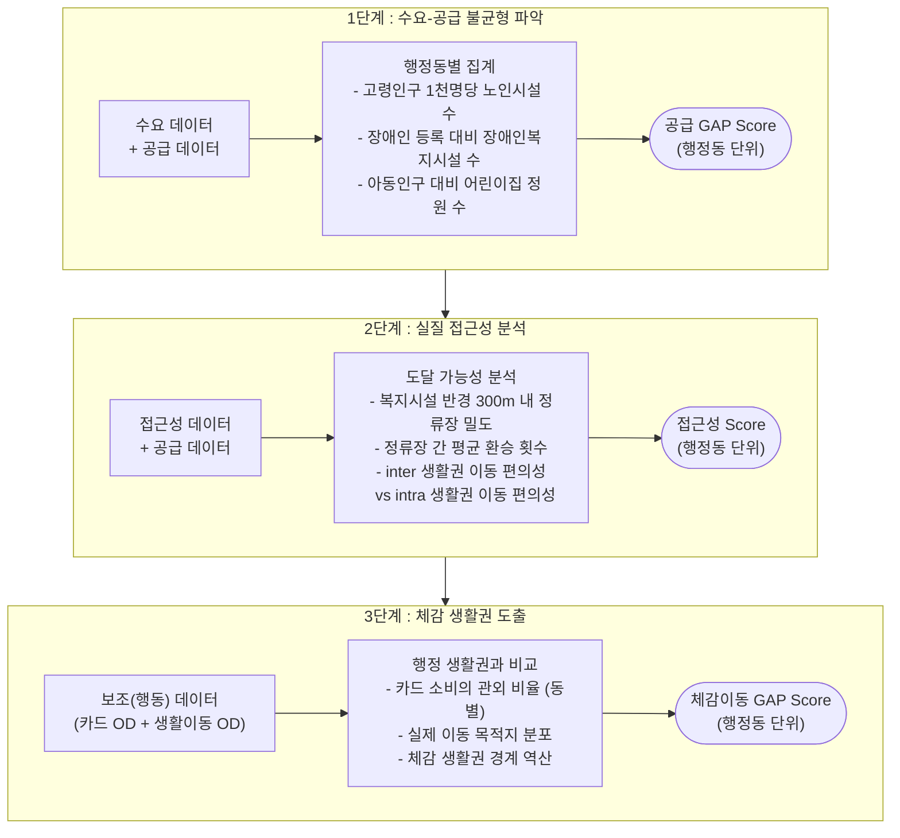
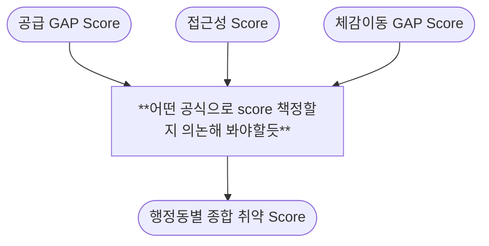
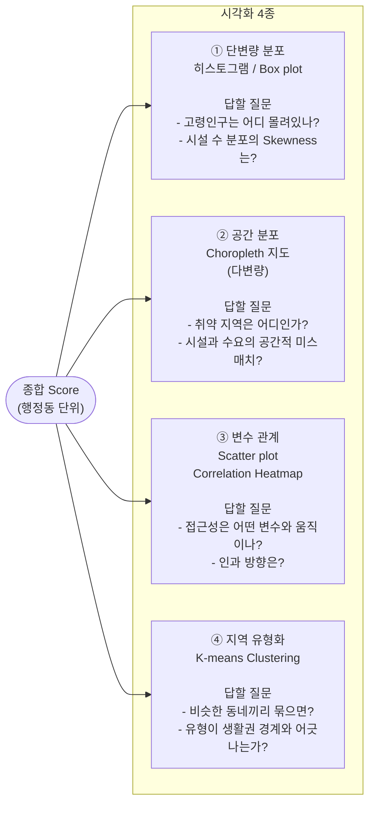
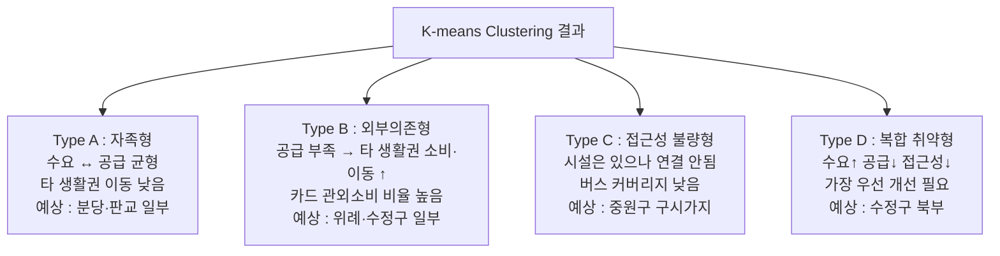
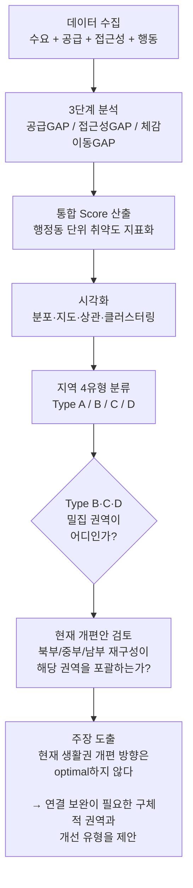

# 성남시 체감 생활권 분석 파이프라인

> **메인 주장** : 성남시의 현재 생활권 개편 방향은 optimal하지 않다  
> 체감 이동 경계 ≠ 행정 생활권 경계 → Type B·C·D 밀집 권역에 우선 개선 필요

---

## 목차

1. [분석 개요](#분석-개요)
2. [데이터 수집 구조](#데이터-수집-구조)
3. [분석 3단계](#분석-3단계)
4. [통합 Score 산출](#통합-score-산출)
5. [시각화 플랜](#시각화-플랜)
6. [지역 유형 분류](#지역-유형-분류)
7. [최종 주장 도출 흐름](#최종-주장-도출-흐름)

---

## 분석 개요

---

## 데이터 수집 구조

세 개의 독립 테이블을 **행정동 코드(법정동 코드)** 기준으로 JOIN하는 구조.

---

## 분석 3단계

---

## 통합 Score 산출

> **가중치 권고** : PCA로 1차 산출 후 선행연구와 비교·보정하는 방식 권장.  
> 공모전 심사 설명을 위해 가중치 근거 문서화 필수.

---

## 시각화 플랜

각 시각화가 답해야 하는 질문을 기준으로 설계.

---

## 지역 유형 분류

클러스터링 결과를 아래 4개 유형으로 프레이밍.

| 유형 | 수요 | 공급 | 접근성 | 체감이동 | 우선순위 |
|------|------|------|--------|----------|----------|
| Type A 자족형 | 보통 | 충분 | 양호 | 내부순환 | 낮음 |
| Type B 외부의존형 | 높음 | 부족 | 보통 | 외부유출↑ | 중간 |
| Type C 접근성 불량형 | 보통 | 보통 | 불량 | 이동 포기 | 중간 |
| Type D 복합 취약형 | 높음 | 부족 | 불량 | 외부유출↑ | **최우선** |

---

## 최종 주장 도출 흐름

---

## 데이터 수집 분담 체크리스트

| 팀원 | 담당 영역 | 주요 출처 | 완료 |
|------|-----------|-----------|------|
| A | 인구·복지 수요 | KOSIS, 행안부, 복지부 | ☐ |
| B | 교통 (대중교통) | TAGO, GBIS, data.go.kr | ☐ |
| C | 생활인프라·시설 공급 | data.go.kr, HIRA, 세움터 | ☐ |
| D | 보조(행동) 데이터 | 빅데이터캠퍼스, 통계청, 국토부 | ☐ |

> 각자 **5개 데이터셋** 확보 후 행정동 코드 기준 JOIN 가능 여부 확인 필수.

---

*최종 업데이트 : 2026-05*
