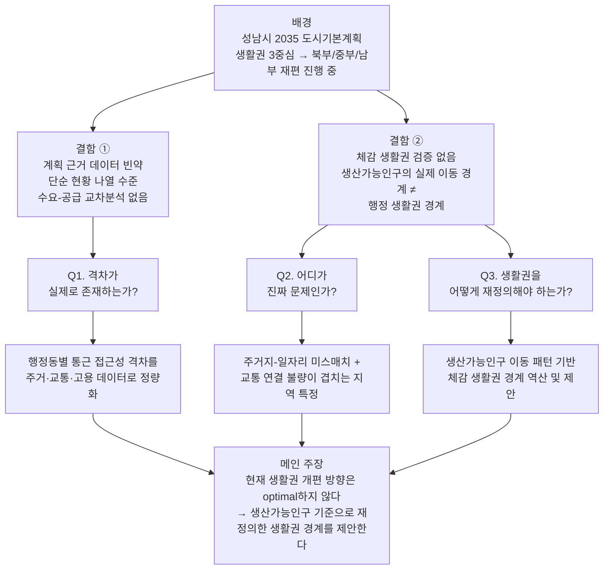
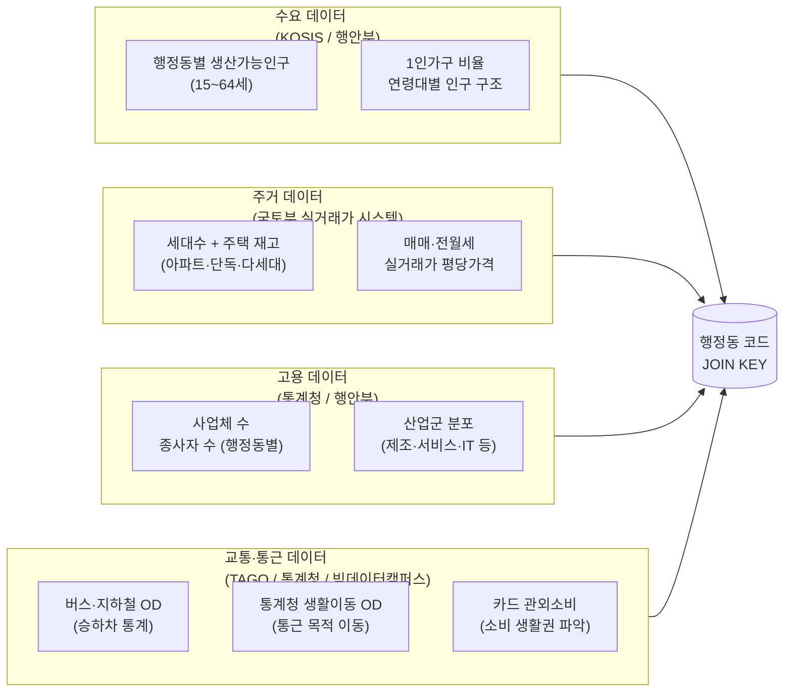
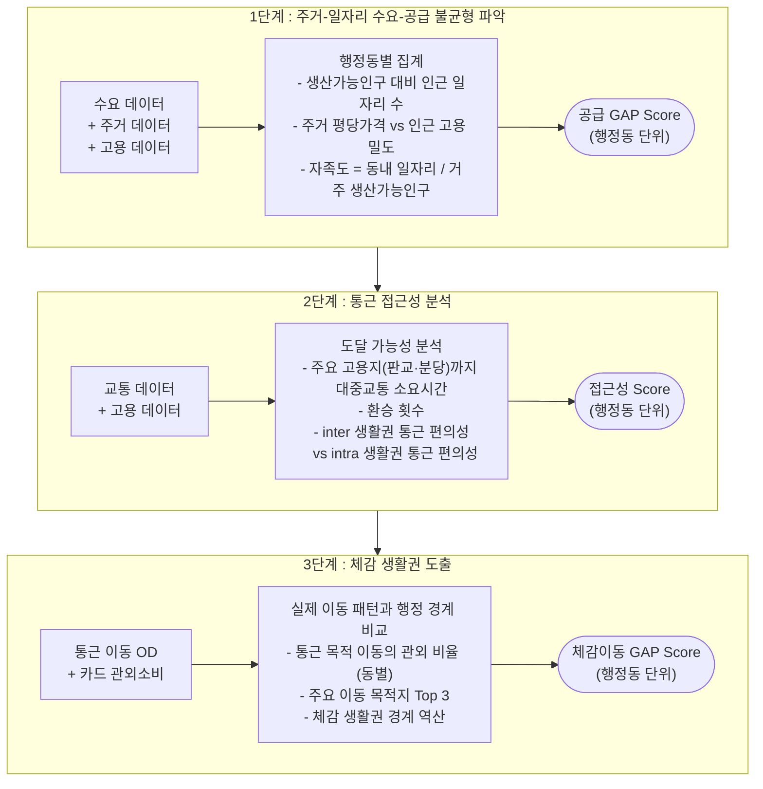
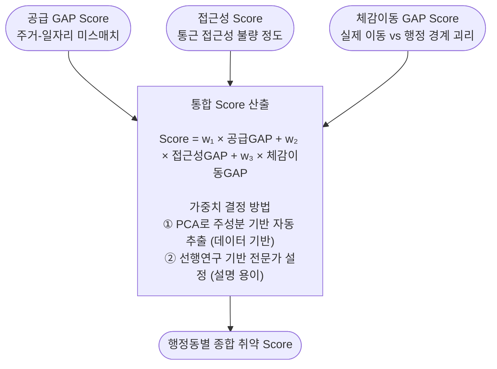
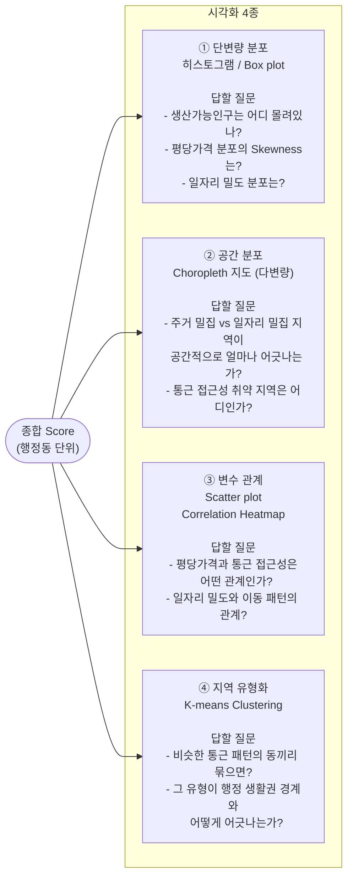
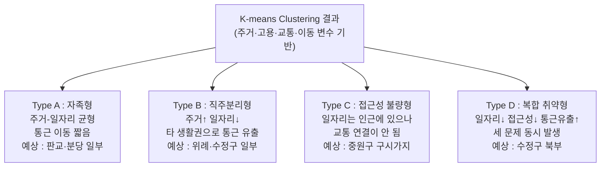
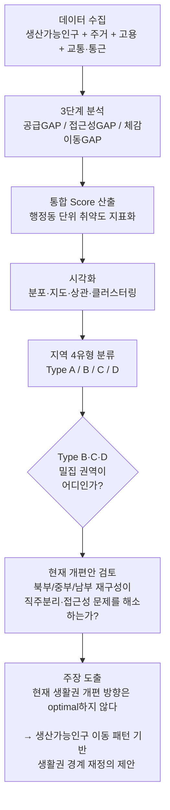

# 성남시 생산가능인구 기준 생활권 재정의 파이프라인

> **메인 주장** : 성남시의 현재 생활권 개편 방향은 optimal하지 않다
> 생산가능인구의 실제 통근·소비 이동 경계 ≠ 행정 생활권 경계 → 생활권 재정의 필요

---

## 목차

1. [분석 개요](#분석-개요)
2. [수요-공급 프레임](#수요-공급-프레임)
3. [데이터 수집 구조](#데이터-수집-구조)
4. [분석 3단계](#분석-3단계)
5. [통합 Score 산출](#통합-score-산출)
6. [시각화 플랜](#시각화-플랜)
7. [지역 유형 분류](#지역-유형-분류)
8. [최종 주장 도출 흐름](#최종-주장-도출-흐름)

---

## 분석 개요

### 배경 : 성남시가 지금 생활권 경계를 다시 긋고 있다

성남시는 **2035 도시기본계획**을 통해 기존 수정·중원·분당 3중심 체계를 폐기하고,
성남 전체를 **북부/중부/남부 생활권**으로 재편하는 작업을 진행 중이다.
즉, 지금이 생활권 경계 설정에 개입할 수 있는 시점이다.

### 문제 : 이 계획에는 두 가지 결함이 있다

**결함 ① 계획의 근거 데이터가 빈약하다**
도시개발계획 자료집의 데이터 분석은 단순 현황 나열 수준에 머물러 있다.
"수정구 고령인구 대비 복지시설이 분당구보다 얼마나 부족한가"와 같은
**수요-공급 교차 분석이 없다.**

**결함 ② 행정이 그은 생활권 경계가 시민의 실제 생활과 일치하는지 검증이 없다**
"북부 생활권으로 묶으면 된다"고 계획했지만,
북부 시민들이 실제로는 분당·판교로 통근·소비하고 있다면 그 계획은 현실과 동떨어진 것이다.
**시민이 체감하는 생활권과 행정이 설계한 생활권이 같다는 전제 자체가 검증된 적이 없다.**

### 목표 : 생산가능인구 기준으로 생활권을 재정의한다

분석의 핵심 질문을 하나로 고정한다.

> **"성남시 행정동별로 생산가능인구의 통근 접근성 격차가 실제로 존재하는가?
> 그리고 그 격차가 현재 생활권 개편 방향으로 해소되는가?"**

---

## 수요-공급 프레임

기존의 복지 수요-공급 프레임을 **생산가능인구 통근** 맥락으로 재정의한다.

| 구분 | 정의 | 데이터 |
|------|------|--------|
| **수요** | 생산가능인구(15~64세)가 거주하는 곳 | 행정동별 인구통계 + 주거 데이터 |
| **공급** | 일자리가 있는 곳 | 사업체 수 + 종사자 수 + 산업군 분포 |
| **연결** | 수요(주거지)와 공급(직장)을 잇는 교통 | 버스·지하철 OD + 통근 이동 데이터 |

> 수요-공급 GAP = 생산가능인구 밀도 대비 인근 일자리 접근성이 부족한 정도
> 이 GAP이 행정동별로 얼마나 다른지가 핵심 논거가 된다.

---

## 데이터 수집 구조

네 개의 독립 테이블을 **행정동 코드** 기준으로 JOIN하는 구조.

---

## 분석 3단계

---

## 통합 Score 산출

> **가중치 권고** : PCA로 1차 산출 후 선행연구와 비교·보정하는 방식 권장.
> 공모전 심사 설명을 위해 가중치 근거 문서화 필수.

---

## 시각화 플랜

각 시각화가 답해야 하는 질문을 기준으로 설계.

---

## 지역 유형 분류

클러스터링 결과를 아래 4개 유형으로 프레이밍.

| 유형 | 공급 GAP | 접근성 | 체감이동 GAP | 의미 | 처방 | 우선순위 |
|------|----------|--------|--------------|------|------|----------|
| **A** 자족형 | 낮음 ✅ | 양호 ✅ | 낮음 ✅ | 주거-일자리 균형, 자급자족 | 현상 유지 | 낮음 |
| **B** 직주분리형 | 높음 ❌ | 보통 🔶 | 높음 ❌ | 주거만 있고 일자리 부족, 통근 유출 | 고용 거점 확충 | 중간 |
| **C** 접근성 불량형 | 낮음 ✅ | 불량 ❌ | 보통 🔶 | 일자리는 인근에 있지만 교통 연결 안됨 | 교통 연결 보완 | 중간 |
| **D** 복합 취약형 | 높음 ❌ | 불량 ❌ | 높음 ❌ | 일자리·교통·이동 세 문제 동시 발생 | 고용+교통+경계 재조정 | **최우선** |

---

## 최종 주장 도출 흐름

---

## 데이터 수집 분담 체크리스트

| 팀원 | 담당 영역 | 주요 출처 | 완료 |
|------|-----------|-----------|------|
| A | 인구통계 (생산가능인구) | KOSIS, 행안부 | ☐ |
| B | 교통·통근 데이터 | TAGO, GBIS, 통계청 생활이동 | ☐ |
| C | 주거 데이터 | 국토부 실거래가 시스템 (rt.molit.go.kr) | ☐ |
| D | 고용·사업체 데이터 + 카드 관외소비 | 통계청, 행안부, 빅데이터캠퍼스 | ☐ |

> 각자 **5개 데이터셋** 확보 후 행정동 코드 기준 JOIN 가능 여부 확인 필수.

---
